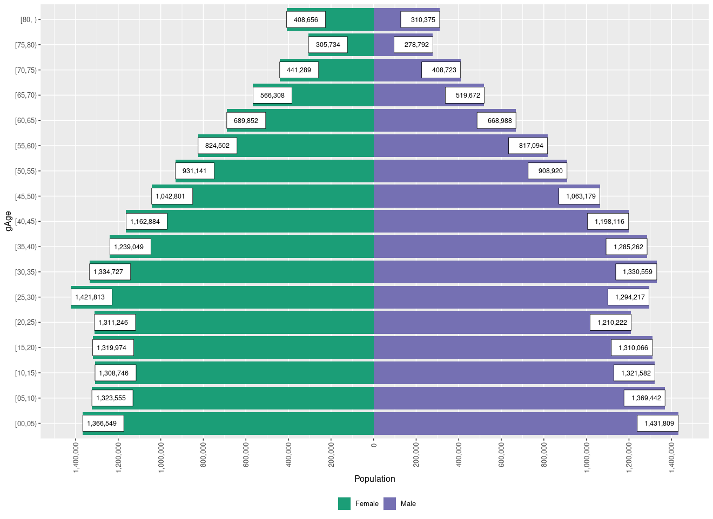
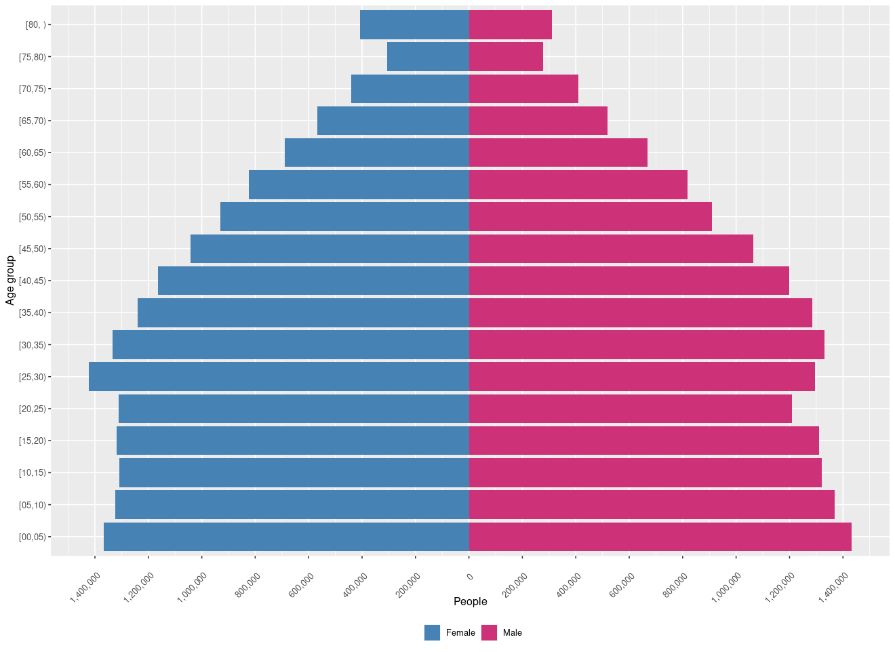
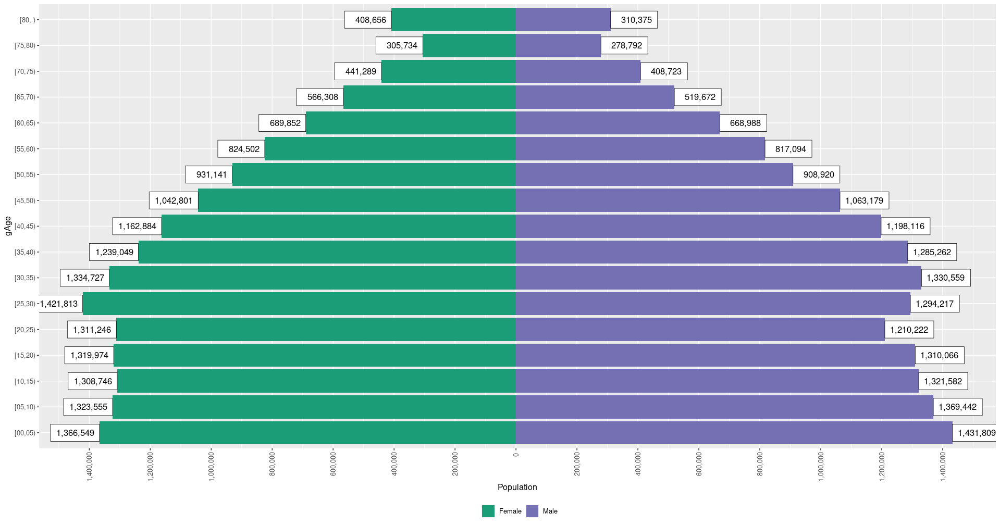
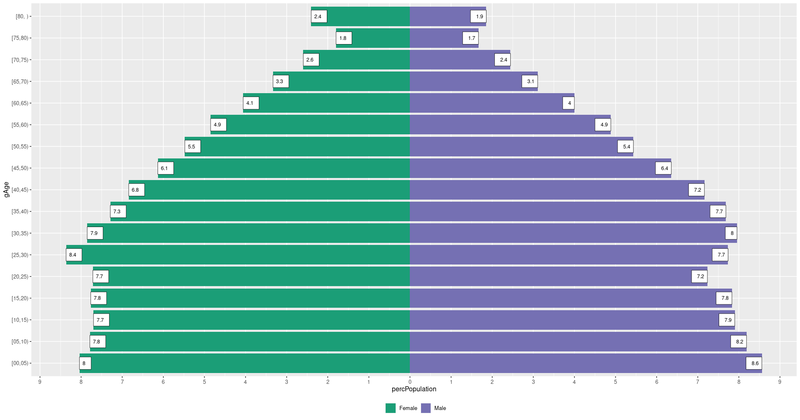
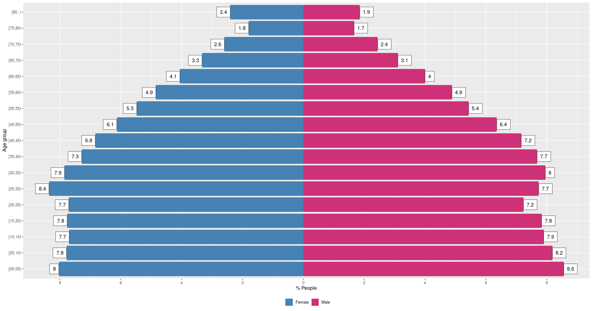

# ggPyramid

<!-- badges: start -->


[](https://github.com/ellerbrock/open-source-badges/)


<!-- badges: end -->

[**ggPyramid**](https://github.com/musajajorge/ggPyramid/) is a package that facilitates the elaboration of population pyramids.

## Installation :arrow_double_down:

Install **ggPyramid**:

``` r
library(remotes)
install_github("musajajorge/ggPyramid")
```

## Usage :muscle:

``` r
library(readxl)
url <- "https://zenodo.org/record/8306939/files/popPER.xlsx?download=1"
destfile <- "popPER.xlsx"
curl::curl_download(url, destfile)
data <- read_excel(destfile)
data <- dplyr::filter(data, Year==2023)
```

### :arrow_right: plotPyramid :arrow_left:

#### Peru's population pyramid, year 2023

Using the default parameters.

``` r
plotPyramid(df=data, age="gAge", group="Sex", pop="Population")
```



#### Peru's population pyramid, year 2023

Modifying the colors, X and Y axis labels, as well as the rotation of the X axis labels.

``` r
plotPyramid(df=data, age="gAge", group="Sex", pop="Population",
            labx="People", laby="Age group",
            twocolors=c("steelblue","violetred3"),
            rotation=45, n.breaks=15, value.labels=FALSE)
```



#### Peru's population pyramid, year 2023

Modifying the position of the values in the bars.

``` r
plotPyramid(df=data, age="gAge", group="Sex", pop="Population",
            value.labels=TRUE, position.value.labels="out",
            size.value.labels=4)
```



### :arrow_right: plotPercPyramid :arrow_left:

#### Percentage pyramid of Peru's population, year 2023

Using the default parameters.

``` r
library(dplyr)
data <- data |>
  group_by(gAge, Sex) |>
  summarise(Population = sum(Population)) |>
  group_by(Sex) |>
  mutate(percPopulation = round(Population/sum(Population)*100, 4)) |>
  select(gAge, Sex, percPopulation) |>
  arrange(Sex, gAge)
```

``` r
plotPercPyramid(df=data, age="gAge", group="Sex", perpop="percPopulation")
```



#### Percentage pyramid of Peru's population, year 2023

Modifying the position of the values on the bars, the X and Y axis labels and the colors of the bars.

``` r
plotPercPyramid(df=data, age="gAge", group="Sex", perpop="percPopulation",
                labx="% People", laby="Age group", n.breaks=10,
                twocolors=c("steelblue","violetred3"),
                value.labels=TRUE, position.value.labels="out",
                size.value.labels=4)
```



------------

<p align="center">
    
</p>
